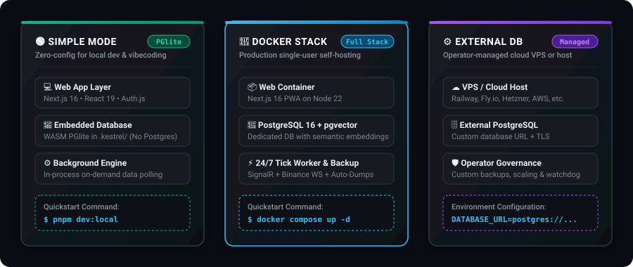
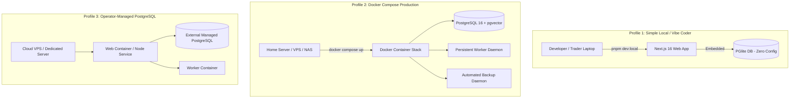
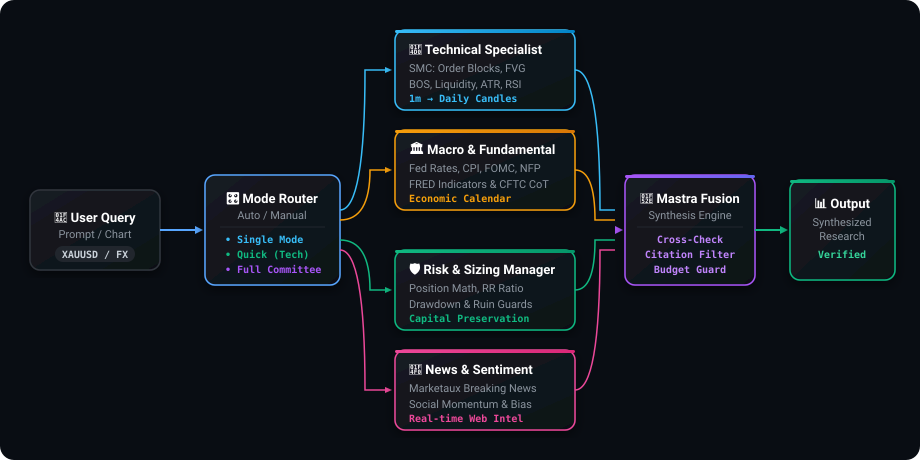
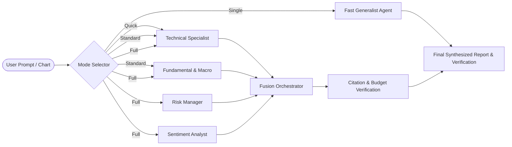

<div align="center">


# Kestrel

### _Your self-hosted AI copilot for gold, forex, and crypto research._

<p align="center">
  <strong>Multi-Agent Intelligence • Smart Money Concepts (SMC) • Real-Time Feeds • BYOK Privacy-First • Zero-Config Setup</strong>
</p>

<p align="center">
  <a href="https://github.com/HamaFx/Kestrel/actions/workflows/ci-fast.yml"></a>
  <a href="https://nodejs.org/"></a>
  <a href="https://nextjs.org/"></a>
  <a href="https://pnpm.io/"></a>
  <a href="https://www.docker.com/"></a>
  <a href="LICENSE"></a>
</p>

<p align="center">
  <a href="#-quickstart-for-vibe-coders--beginners-60-seconds">⚡ 60-Second Quickstart</a> •
  <a href="#-self-hosted-deployment-profiles">🚀 Deployment Profiles</a> •
  <a href="#-key-features">✨ Features</a> •
  <a href="#-ai-agent-committee--analysis-modes">🤖 AI Agent Committee</a> •
  <a href="#-market-data--smc-indicators">📊 SMC & Indicators</a> •
  <a href="#-configuration--byok">🔑 BYOK & Config</a> •
  <a href="#-troubleshooting--faq">🛠️ Troubleshooting</a>
</p>

---

</div>

> [!IMPORTANT]
> **Open-Source Single-User Boundary:** The public release is currently a **single-user, self-hosted preview**. BYOK (Bring Your Own Key) is enabled by default with AES-256 encryption at rest. Multi-user shared public SaaS mode, open registration, and runtime RLS mode are intentionally disabled until tenant isolation proofs are complete. See [Security Boundary](#-security--privacy-boundary).

> [!NOTE]
> **Trading Disclaimer:** Kestrel is an advanced research and quantitative decision-support copilot, **not financial advice, a licensed broker, or an automated execution system**. Market data can experience latency or inaccuracies. Always verify market information independently and manage risk responsibly.

---

## 🌟 What is Kestrel?

Trading gold (`XAUUSD`), forex, and crypto requires analyzing price action, institutional order flow, macroeconomic releases (CPI, FOMC, NFP), Smart Money Concepts (FVG, Order Blocks), and risk mathematics.

**Kestrel turns your chat terminal and browser into an institutional-grade research workspace:**

- 🧠 **4-Agent AI Committee**: Technical, Fundamental, Risk, and Sentiment specialist agents collaborate using [Mastra](https://mastra.ai) to synthesize multi-factor trade ideas with strict citations and guardrails.
- 📐 **Institutional Smart Money Concepts (SMC)**: Native detection of Order Blocks, Fair Value Gaps (FVG), Liquidity Sweeps, Asian Session Killzones, and Market Structure Shifts (BOS/CHoCH).
- ⚡ **Dual Real-Time Feeds**: SignalR sub-second streaming for Gold & Forex, plus Binance WebSockets for 24/7 crypto candles.
- 🔒 **100% Privacy & Data Sovereignty (BYOK)**: Use your own API keys (OpenAI, Gemini, Anthropic, DeepSeek, Groq, Ollama). Your keys are encrypted at rest on your hardware with `ENCRYPTION_SECRET`. Zero telemetry leaks.
- 🛠️ **Zero-Friction Self-Hosting**: Run locally in 60 seconds with embedded PGlite (no database installation needed) or launch the full stack with 1-click Docker Compose.

---

## ⚡ Quickstart for Vibe Coders & Beginners (60 Seconds)

No complex database setup or cloud infrastructure required! Get running on your laptop in 3 simple steps:

### Prerequisites

- **Node.js 22.13+** (or newer)
- **pnpm 9+** (`npm install -g pnpm`)
- _(Optional)_ **Docker Desktop** (only if running the full Docker PostgreSQL stack)

---

### Option 1: Interactive Wizard (Recommended)

```bash
# 1. Clone the repository
git clone https://github.com/HamaFx/Kestrel.git
cd Kestrel

# 2. Run the zero-dependency interactive setup wizard
pnpm setup
```

The wizard will:

1. Validate your environment and Node.js version (`>=22.13.0`).
2. Help you choose between **Simple (PGlite - zero config)** or **Docker (PostgreSQL + Worker)**.
3. Automatically generate cryptographically secure secrets (`AUTH_SECRET`, `ENCRYPTION_SECRET`, `CRON_SECRET`).
4. Install dependencies and start the app at `http://localhost:3000`.

---

### Option 2: 1-Line Zero-Config Simple Mode (PGlite)

If you want to run Kestrel immediately without Docker or PostgreSQL, Kestrel includes an **in-memory embedded PGlite database**:

```bash
# Install dependencies
pnpm install

# Start local dev server (PGlite boots automatically!)
pnpm dev:local
```

1. Open **[http://localhost:3000](http://localhost:3000)** in your browser.
2. Register your master account on the first screen (Owner-first registration).
3. Navigate to **Settings → API Keys** and paste your AI provider key (OpenAI, Gemini, Anthropic, DeepSeek, Groq, or Ollama).
4. Start chatting with live market data! 🚀

---

### Option 3: 1-Click Production Docker Stack

For a complete self-hosted production setup with persistent PostgreSQL 16, pgvector, and the background tick worker:

```bash
# Generate secure secrets into .env
./docker/init-secrets.sh

# Spin up all containers (PostgreSQL + Web App + Background Worker + Auto-Backup)
docker compose up -d --build
```

Open **[http://localhost:3000](http://localhost:3000)** to access your instance.

---

## 🚀 Self-Hosted Deployment Profiles

Kestrel offers three self-hosted deployment profiles designed for complete data sovereignty:

<p align="center">
  
</p>

<details>
<summary>🔍 <strong>View Diagram Source</strong></summary>



</details>

### Profile Matrix

| Profile                    | Database                 |       Worker Daemon        | Use Case                              | Setup Effort                        |
| :------------------------- | :----------------------- | :------------------------: | :------------------------------------ | :---------------------------------- |
| 🟢 **Simple**              | Embedded PGlite          |         In-Process         | Local testing, evaluation, vibecoding | **60 Seconds** (Zero config)        |
| 🐳 **Docker Stack**        | PostgreSQL 16 + pgvector |    Dedicated Container     | Complete self-hosted production stack | **1 Command** (`docker compose up`) |
| ⚙️ **External PostgreSQL** | Operator PostgreSQL      | Dedicated Container / Host | Advanced self-hosting on VPS / Cloud  | Operator-managed                    |

---

## ✨ Key Features

<div align="center">

| Feature                     | Description                                                                                 |
| :-------------------------- | :------------------------------------------------------------------------------------------ |
| 🤖 **Multi-Agent Research** | 4 specialized Mastra agents (Technical, Fundamental, Risk, Sentiment) + Fusion synthesizer. |
| 📊 **Smart Money Concepts** | Order Blocks, Fair Value Gaps (FVG), Liquidity pools, Asian Range, BOS/CHoCH.               |
| 📈 **Interactive Studio**   | Live candlestick charts with multi-timeframe analysis, indicators, and image upload vision. |
| 📅 **Macro Intelligence**   | Real-time economic calendar (CPI, NFP, FOMC) with live countdowns & consensus data.         |
| 📓 **Interactive Journal**  | Trade logger with automated screenshot attachments, R-multiple calculations, and replay.    |
| 🚨 **Multi-Channel Alerts** | Instant alert triggers delivered via **Telegram Bot**, **Web Push**, or **Email (Resend)**. |
| 🔑 **Encrypted BYOK**       | 100% user-owned API keys stored with AES-256 encryption. Support for 8+ AI providers.       |
| 🛡️ **Defensive Guardrails** | Strict prompt-injection sanitization, daily cost budget caps, and tool-iteration limits.    |

</div>

---

## 🤖 AI Agent Committee & Analysis Modes

Kestrel uses a multi-agent orchestration architecture built on **Mastra**. Rather than relying on a single generic LLM prompt, specialized agents evaluate market conditions independently before synthesizing a final research report.

<p align="center">
  
</p>

<details>
<summary>🔍 <strong>View Diagram Source</strong></summary>



</details>

### Analysis Modes

1. ⚡ **Single (`single`)**: Rapid single-turn response for quick price lookups, conversions, and simple questions (~1-2s).
2. 🎯 **Quick (`quick`)**: Dedicated Technical Analyst focusing on candlestick structure, trend, SMC levels, and momentum (~3s).
3. ⚖️ **Standard (`standard`)**: Technical Analyst + Macro/Fundamental Specialist (Fed rates, economic calendar, inflation trends) (~5s).
4. 🏛️ **Full Committee (`full`)**: All 4 specialist agents (Technical + Fundamental + Risk Math + Sentiment) with cross-verification and fusion synthesis (~8s).
5. 🪄 **Auto (`auto`)**: Natural language classification automatically selects the optimal mode based on your query.

---

## 📊 Market Data & SMC Indicators

### Supported Markets

- 🟡 **Gold / Commodities**: `XAUUSD` (Spot Gold vs USD)
- 💱 **Forex**: `EURUSD`, `GBPUSD`, `USDJPY`, `AUDUSD`, `USDCAD`, `USDCHF`, `NZDUSD`, `EURGBP`, `EURJPY`, `GBPJPY`
- 🪙 **Crypto**: `BTCUSDT`, `ETHUSDT`, `SOLUSDT`, `BNBUSDT`, `XRPUSDT`, and top Binance pairs

### Institutional Smart Money Concepts (SMC) Engine

- 🧱 **Order Blocks (OB)**: High-probability institutional supply & demand zones.
- ⚡ **Fair Value Gaps (FVG)**: Imbalance detection across 1m, 5m, 15m, 1h, 4h, and Daily timeframes.
- 🌊 **Liquidity Sweeps**: Identification of buy-side (BSL) and sell-side (SSL) liquidity pools.
- 🔄 **Market Structure**: Automatic detection of Break of Structure (**BOS**) and Change of Character (**CHoCH**).
- 🌏 **Session Killzones**: Asian Range high/low tracking, London Open Killzone, New York Open Killzone.
- 🎯 **Session Levels**: Previous Day High/Low (**PDH/PDL**), Weekly High/Low (**PWH/PWL**).

### Technical & Macro Indicators

- **Momentum & Trend**: RSI (14), MACD (12, 26, 9), Multi-period EMAs (20, 50, 200), Bollinger Bands (20, 2).
- **Volatility & Risk**: Average True Range (**ATR**), Historical Volatility, Position Sizing formulas.
- **Macro & Sentiment**: FRED (Federal Reserve Economic Data), CFTC Commitment of Traders (**COT**), Marketaux Financial News Sentiment.

---

## 🔑 Configuration & BYOK

Kestrel features **zero-friction BYOK**. You don't need to configure AI keys in environment files—simply paste them into the UI under **Settings → API Keys**.

### Supported AI Providers

| Provider              | Supported Models                                   | In-App BYOK |
| :-------------------- | :------------------------------------------------- | :---------: |
| 🟢 **OpenAI**         | GPT-4o, GPT-4o-mini, o1, o3-mini                   |     ✅      |
| 🔵 **Google Gemini**  | Gemini 2.5 Pro, Gemini 2.5 Flash, Gemini 2.0 Flash |     ✅      |
| 🟣 **Anthropic**      | Claude 3.7 Sonnet, Claude 3.5 Haiku                |     ✅      |
| ⚡ **Groq**           | Llama 3.3 70B, DeepSeek R1 Distill (Ultra-fast)    |     ✅      |
| 🐋 **DeepSeek**       | DeepSeek V3, DeepSeek R1                           |     ✅      |
| 🦙 **Ollama (Local)** | Llama 3, Mistral, Qwen (100% Offline)              |     ✅      |
| 🌐 **OpenRouter**     | Any open routing endpoint                          |     ✅      |

---

### Environment Variables Reference

For Docker or VPS deployments, copy `.env.example` to `.env`:

```bash
cp .env.example .env
```

#### Core Variables (Production / Docker)

```dotenv
# Application URLs
NODE_ENV=production
NEXT_PUBLIC_APP_URL=http://localhost:3000
PORT=3000

# Authentication & Encryption (Generate with: openssl rand -hex 32)
AUTH_SECRET=your_32_character_random_hex_string
ENCRYPTION_SECRET=your_32_character_encryption_secret
CRON_SECRET=your_16_character_cron_bearer_token

# Database (Bundled Docker default)
DATABASE_URL=postgres://hamafx:your_postgres_password@db:5432/hamafx
POSTGRES_PASSWORD=your_postgres_password

# Open Source Security Boundary (Keep single-user mode enabled)
OSS_SINGLE_USER_MODE=1
MULTI_USER_ENABLED=0
KESTREL_ENABLE_RLS=0
REGISTRATION_MODE=owner-first
BYOK_ENABLED=1
```

#### Optional Integrations

```dotenv
# Telegram Bot Alerts
TELEGRAM_BOT_TOKEN=123456:ABC-DEF1234ghIkl-zyx57W2v1u123ew11
TELEGRAM_CHAT_ID=your_telegram_chat_id

# Email Alerts (Resend)
RESEND_API_KEY=re_123456789
ALERT_FROM_EMAIL=alerts@yourdomain.com

# Web Search (AI Real-time web browsing)
WEB_SEARCH_ENABLED=1
WEB_SEARCH_PROVIDER=exa # exa | tavily | brave
EXA_API_KEY=your_exa_api_key

# External Market Data (Optional fallbacks)
FINNHUB_API_KEY=your_finnhub_key
FRED_API_KEY=your_fred_stlouisfed_key
MARKETAUX_API_KEY=your_marketaux_key
```

---

## 🛠️ Developer & Contributor Guide

### Monorepo Structure

```text
kestrel/
├── apps/
│   ├── web/               # Next.js 16 PWA, Auth.js, Chat UI, Studio, App Router
│   └── worker/            # Long-running Node.js daemon (SignalR, WebSocket, Cron)
├── packages/
│   ├── ai/                # Mastra agents, workflows, tools, memory, routing
│   ├── data/              # Market data adapters, failover manager, caching
│   ├── db/                # Drizzle ORM schema, migrations, PGlite & Postgres clients
│   ├── indicators/        # Pure TypeScript SMC & Technical Indicators math
│   ├── shared/            # Zod validation schemas, encryption, logging, types
│   ├── config/            # Shared TypeScript & ESLint configs
│   └── test-utils/        # Testing factories, mocks, and Vitest fixtures
├── docker/                # Docker compose configs, entrypoints, backup scripts
└── docs/                  # Architecture, configuration, and troubleshooting guides
```

### Essential Commands

```bash
# Install workspace dependencies
pnpm install --frozen-lockfile

# Typecheck and lint
pnpm typecheck
pnpm lint

# Run unit and integration test suite (Vitest)
pnpm test

# Run End-to-End browser tests (Playwright)
pnpm test:e2e

# Run Open Source release and security verification checks
pnpm check:oss-release
pnpm check:route-security
pnpm check:env-contract
pnpm check:p0-release
pnpm check:single-user-release
```

---

## 🔒 Security & Privacy Boundary

Kestrel is designed with strict privacy and security defaults:

- 🛡️ **Owner-First Registration**: The first user to access the fresh instance creates the owner account. Subsequent open registrations are blocked in single-user mode.
- 🔐 **AES-256 BYOK Encryption**: Stored provider keys are encrypted with `ENCRYPTION_SECRET`. Decrypted keys exist only in memory during the duration of an active tool call.
- 🚫 **Strict Prompt Injection Defenses**: Input sanitization, Unicode normalization, and strict tool-loop iteration caps prevent prompt manipulation.
- 🛑 **No Leaked Telemetry**: Observability (Sentry / Langfuse) is strictly opt-in and disabled by default.

> [!WARNING]
> Always retain a secure backup of your `ENCRYPTION_SECRET`. If you lose this key, stored BYOK credentials in the database cannot be decrypted.

---

## 🛠️ Troubleshooting & FAQ

<details>
<summary><strong>Q: How do I run Kestrel without Docker or installing PostgreSQL?</strong></summary>

Simply run `pnpm dev:local`! Kestrel embeds **PGlite**, a lightweight WebAssembly/Node PostgreSQL engine that creates a zero-config local database inside the `.kestrel/` folder.
</details>

<details>
<summary><strong>Q: Port 3000 or Port 5432 is already in use on my machine. What should I do?</strong></summary>

- For web port 3000: Set `PORT=3005` in your `.env.local` or run `PORT=3005 pnpm dev:local`.
- For Docker Postgres port 5432: Set `POSTGRES_PUBLISHED_PORT=127.0.0.1:5433` in your `.env` before running `docker compose up -d`.

</details>

<details>
<summary><strong>Q: How do I backup my trades, journals, and settings?</strong></summary>

- **In Simple Mode**: Your database lives in `.kestrel/data`. Copy this folder to a secure location.
- **In Docker Mode**: The backup service automatically creates daily compressed SQL dumps in the `backup-data` volume. Run `./docker/backup-db.sh` anytime for an instant manual snapshot.

</details>

<details>
<summary><strong>Q: Can I use free local AI models with Ollama?</strong></summary>

Yes! Install [Ollama](https://ollama.ai), run your model (e.g. `ollama run llama3`), then in Kestrel navigate to **Settings → API Keys → Ollama**, set the endpoint to `http://localhost:11434`, and select your model.
</details>

---

## 📄 Documentation Map

For detailed guides, explore the `docs/` directory:

- 📖 **[Configuration Reference](docs/configuration.md)**: Exhaustive list of all environment variables and secrets.
- 🏛️ **[Architecture Deep-Dive](docs/architecture.md)**: Full breakdown of layered packages, data flow, and worker lifecycle.
- 🔧 **[Troubleshooting Guide](docs/troubleshooting.md)**: Solutions for common database, network, provider, and build issues.
- 🚀 **[Release Guide](docs/release.md)**: Validation checklist, Docker image publication, and versioning.
- 🛡️ **[Security Policy](SECURITY.md)**: Vulnerability disclosure, encryption architecture, and security practices.
- 🤝 **[Contributing Guide](CONTRIBUTING.md)**: How to submit bug fixes, features, and new market indicators.

---

## 📜 License

Kestrel is open-source software released under the **[Apache License 2.0](LICENSE)**.

<div align="center">

**Built with precision for serious traders and quantitative researchers.**

_Trade smart. Manage risk. Never trade on blind certainty._

</div>
