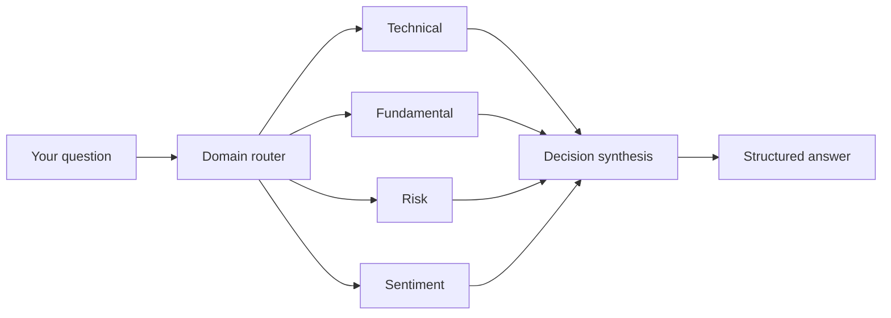
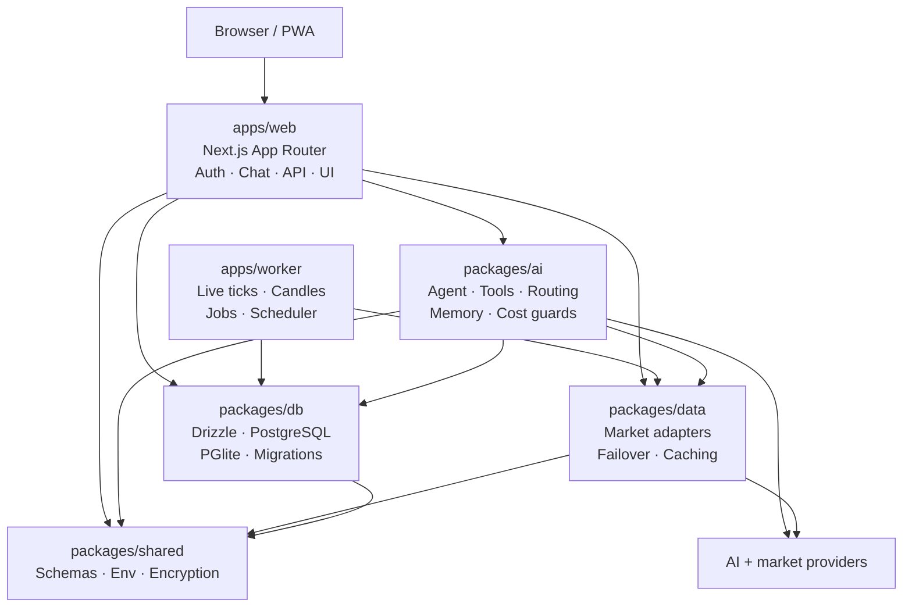

<div align="center">


# Kestrel

<pre>
█▄█ █▀▀ █▀▀ ▀█▀ █▀█ █▀▀ █  
█▀▄ █▀▀ ▀▀█  █  █▀▄ █▀▀ █  
▀ ▀ ▀▀▀ ▀▀▀  ▀  ▀ ▀ ▀▀▀ ▀▀▀


</pre>

### Your self-hosted AI copilot for gold, forex, and crypto research.

Chat with market data, technical structure, macro context, risk math, journals, alerts, and multi-agent analysis — using **your own AI provider keys** and your own infrastructure.

<p>
  <a href="https://github.com/HamaFx/Kestrel/actions/workflows/ci-fast.yml"></a>
  <a href="https://github.com/HamaFx/Kestrel/blob/main/LICENSE"></a>
  <a href="https://github.com/HamaFx/Kestrel/releases"></a>
  <a href="https://github.com/HamaFx/Kestrel"></a>
</p>

<p>
  <a href="#-quick-start">Get started</a> ·
  <a href="#-what-you-can-do">Explore features</a> ·
  <a href="#-architecture">Architecture</a> ·
  <a href="docs/11-self-hosting.md">Self-hosting guide</a> ·
  <a href="CONTRIBUTING.md">Contribute</a>
</p>

</div>

> **OSS release boundary:** The public release is currently a **single-user, self-hosted preview**. BYOK is enabled by default. Shared multi-user PostgreSQL, open registration, and runtime RLS mode are intentionally disabled until tenant isolation is complete. See [the security boundary](#-important-oss-boundary).

> **Trading disclaimer:** Kestrel is a research and workflow tool, not financial advice, a broker, or an automated trading system. Market data can be delayed or wrong. Always verify information independently and trade at your own risk.

---

## 🌌 What is Kestrel?

Kestrel turns a chat window into a market-research workspace for:

- **Gold:** `XAUUSD`
- **Forex:** EURUSD, GBPUSD, USDJPY, AUDUSD, USDCAD, NZDUSD, USDCHF, EURGBP, EURJPY, GBPJPY, AUDJPY
- **Crypto:** BTCUSDT, ETHUSDT, SOLUSDT, BNBUSDT, XRPUSDT, ADAUSDT
- **Your workflow:** analysis, risk planning, journaling, alerts, and review

Instead of jumping between charts, indicators, news tabs, spreadsheets, and notes, you can ask one question and let the copilot gather structured context before answering.

```text
You:    “Analyze XAUUSD on the 1H chart and tell me what would invalidate the idea.”

Agent:  1. Reads current price and candles
        2. Computes indicators and market structure
        3. Checks macro/news context when relevant
        4. Runs risk and verification logic
        5. Explains the result with citations and uncertainty
```

Kestrel is designed to be **self-hosted first**: you control the deployment, the database, the encryption secret, and which AI provider receives your prompts.

<p align="center">
  
</p>

<p align="center"><sub>Illustrative workspace preview · synthetic values · dark, data-first trading-terminal design</sub></p>

---

## ✨ Why people use it

|     | Capability                 | What it means in practice                                                                                |
| --- | -------------------------- | -------------------------------------------------------------------------------------------------------- |
| 💬  | **Chat-first research**    | Ask questions in plain language instead of assembling every analysis manually.                           |
| 📈  | **Technical context**      | Candles, indicators, market structure, sessions, correlations, seasonality, and volatility.              |
| 🌍  | **Macro context**          | News, economic calendar events, CFTC positioning, intermarket relationships, and sentiment.              |
| 🧮  | **Risk math**              | Position sizing, stop/target distances, R-multiples, open-position health, and guardrails.               |
| 🧠  | **Multi-agent analysis**   | Technical, fundamental, risk, and sentiment specialists can analyze a setup before a decision synthesis. |
| 📝  | **Trading journal**        | Record trades, review decisions, compute statistics, and build durable memory from your process.         |
| 🔔  | **Alerts**                 | Create one-shot price, indicator, and candle-close alerts through chat.                                  |
| 📊  | **Interactive charts**     | Use TradingView charts alongside the conversational workflow.                                            |
| 🔐  | **BYOK**                   | Bring keys from supported providers; credentials are encrypted at rest on your instance.                 |
| 📱  | **PWA experience**         | Use the responsive web app on desktop or install it on a mobile device.                                  |
| 🛡️  | **Operational guardrails** | Authentication, CSRF protection, rate limits, cost budgets, telemetry, retries, and citation checks.     |

---

## 🚀 Quick start

The easiest path is the built-in setup wizard. It explains each choice and creates the configuration for you.

### 1. Install the prerequisites

You need:

- [Node.js 20.11+](https://nodejs.org/)
- [pnpm 9+](https://pnpm.io/installation) — or Node.js Corepack enabled
- [Docker Desktop](https://www.docker.com/products/docker-desktop/) only if you want **Full mode**

### 2. Download the project

You can clone it with Git or download the repository as a ZIP from GitHub.

```bash
git clone https://github.com/HamaFx/Kestrel.git
cd Kestrel
```

### 3. Start the setup wizard

```bash
pnpm setup
```

The wizard offers two choices:

| Mode       | Choose it when                          | What it provides                                                             |
| ---------- | --------------------------------------- | ---------------------------------------------------------------------------- |
| **Simple** | You want to try the app quickly         | Embedded PGlite database, no Docker, fast local startup                      |
| **Full**   | You want the complete self-hosted stack | PostgreSQL + pgvector, worker, live pipeline, backups, and all core features |

The wizard will:

- Check your computer and explain anything missing.
- Wait for Docker Desktop if it is still starting.
- Back up any existing config before touching it.
- Generate secure local settings automatically.
- Preserve existing environment settings.
- Keep AI keys out of the terminal setup flow.
- Start the app and wait for it to become healthy.
- Open the app in your browser when possible.

#### Setup wizard options

The wizard accepts several flags for scripting and non-interactive use:

| Flag                    | What it does                                                                |
| ----------------------- | --------------------------------------------------------------------------- |
| `--mode=simple\|docker` | Skip the mode question                                                      |
| `--market=ID,ID`        | Configure market providers (`finnhub`, `marketaux`, `fred`, `alphavantage`) |
| `--fresh`               | Regenerate config (the previous config is backed up first)                  |
| `--skip-install`        | Do not install dependencies                                                 |
| `--no-launch`           | Do not start the app afterwards                                             |
| `--yes`                 | Accept defaults; never prompt                                               |
| `--dry-run`             | Print exactly what would change, write nothing                              |
| `--json`                | Machine-readable result on stdout (for CI/scripts)                          |
| `--no-color`            | Plain output (equivalent to setting `NO_COLOR`)                             |
| `--help`, `-h`          | Show all options                                                            |

```bash
pnpm setup                      # interactive (recommended)
pnpm setup --dry-run            # preview before changing anything
pnpm setup --mode=simple --yes  # quiet, non-interactive
pnpm setup --json               # machine-readable result
```

### 4. Create your owner account

When the app opens:

1. Register the first account.
2. Complete the onboarding flow.
3. Add an AI provider key in the app under **Settings → API Keys**.
4. Start with a question such as:

```text
“What is the current XAUUSD price, and what technical context should I check next?”
```

Your AI key is encrypted at rest using your instance's `ENCRYPTION_SECRET`. It is sent to the selected provider only when the app uses that provider; Kestrel does not provide a shared maintainer key in the OSS setup.

### Manual commands

```bash
# Simple mode
pnpm install
pnpm dev:local

# Full mode — Docker Desktop must be running
./docker/init-secrets.sh
docker compose up -d --build

# Open the app
# http://localhost:3000
```

For detailed deployment, updates, backups, restore, reverse proxy, and troubleshooting instructions, see the [self-hosting guide](docs/11-self-hosting.md).

---

## 🔑 Bring Your Own Key (BYOK)

Kestrel does not bundle AI access. You bring the provider account and pay the provider directly, where applicable.

### Supported AI providers

| Provider                                                       | Best suited for                   | Pricing note                             |
| -------------------------------------------------------------- | --------------------------------- | ---------------------------------------- |
| [Google Gemini](https://aistudio.google.com/apikey)            | Fast general analysis and vision  | Free and paid options vary by model      |
| [Google Vertex AI](https://console.cloud.google.com/vertex-ai) | Google Cloud deployments          | Usage billed through Google Cloud        |
| [Anthropic](https://console.anthropic.com/settings/keys)       | Reasoning and analysis            | Paid provider                            |
| [OpenAI](https://platform.openai.com/api-keys)                 | General-purpose and vision models | Paid provider                            |
| [Groq](https://console.groq.com/keys)                          | Fast, low-latency inference       | Free and paid options vary               |
| [Mistral](https://console.mistral.ai/api-keys)                 | European provider option          | Free and paid options vary               |
| [OpenRouter](https://openrouter.ai/keys)                       | Access to multiple model families | Provider/model dependent                 |
| [xAI](https://console.x.ai)                                    | Grok reasoning and agentic tools  | Paid provider                            |
| [DeepSeek](https://platform.deepseek.com/api_keys)             | Low-cost reasoning                | Provider pricing applies                 |
| IAMHC API                                                      | Aggregated multi-model access     | Check IAMHC terms and pricing before use |

> Provider names, models, and capabilities change over time. Treat the in-app catalog and each provider's official documentation as the source of truth.

### What BYOK does — and does not — mean

- **You control billing:** Kestrel does not pay for your model usage in self-hosted mode.
- **You control storage:** keys are encrypted in your database using your `ENCRYPTION_SECRET`.
- **You control deployment:** run locally, on your own server, or with Docker.
- **The server still handles requests:** a self-hosted Kestrel instance must access the key to call the selected provider. Protect the server, database, backups, and encryption secret accordingly.
- **Never commit secrets:** keep `.env`, `.env.local`, `.kestrel/`, provider keys, database URLs, and service-account files out of Git.

---

## 🧭 What you can do

### Ask questions naturally

```text
“Compare the technical bias on XAUUSD and EURUSD.”
“Show me the London session range.”
“What macro events could affect gold today?”
“Calculate position size for a $10,000 account risking 0.5%.”
“Review my last five journal entries.”
“Set an alert if XAUUSD closes above yesterday’s high.”
```

### Use 33 focused AI tools

The agent routes work to typed tools instead of relying on free-form model guesses.

<details>
<summary><strong>View the tool catalogue</strong></summary>

| Area                              | Tools                                                                                                                                                             |
| --------------------------------- | ----------------------------------------------------------------------------------------------------------------------------------------------------------------- |
| **Live market data**              | `get_price`, `get_candles`, `get_indicators`, `get_market_structure`, `get_session_levels`                                                                        |
| **Technical analysis**            | `analyze_technical`, `annotate_chart`, `forecast_volatility`, `replay_setup`                                                                                      |
| **Macro and cross-market**        | `get_news`, `get_calendar`, `get_cot`, `get_correlation`, `get_intermarket`, `get_intermarket_resonance`, `get_seasonality`, `get_social_sentiment`, `web_search` |
| **Risk and verification**         | `compute_risk`, `compute_position_health`, `verify_call`, `get_portfolio_snapshot`                                                                                |
| **Journal and memory**            | `log_journal`, `get_journal_stats`, `search_knowledge`                                                                                                            |
| **Actions and sharing**           | `set_alert`, `share_snapshot`                                                                                                                                     |
| **Research modes and operations** | `analyze_fundamental`, `analyze_chart_image`, `get_system_diagnostics`, `run_system_action`                                                                       |

The exact catalogue is maintained in [`packages/ai/src/tools/`](packages/ai/src/tools/).

</details>

### Multi-agent deliberation through Mastra workflows

The symbol-research workflow runs specialist perspectives in parallel:



The risk perspective can veto unsafe recommendations, while the final synthesis explains where the specialists agree or disagree. It is decision support — not an autonomous trading signal.

---

## 🧱 Simple mode vs Full mode

|                          | Simple mode                    | Full mode                 |
| ------------------------ | ------------------------------ | ------------------------- |
| Database                 | Embedded PGlite                | PostgreSQL 16 + pgvector  |
| Docker                   | Not required                   | Required                  |
| Web app                  | ✅                             | ✅                        |
| AI chat                  | ✅                             | ✅                        |
| Journal and alerts       | ✅                             | ✅                        |
| Technical tools          | ✅                             | ✅                        |
| Vector search / RAG      | Unavailable in Simple mode     | ✅                        |
| Worker and live pipeline | Not included                   | ✅                        |
| Automated backups        | Not included                   | ✅                        |
| Langfuse observability   | Not included                   | Optional profile          |
| Best for                 | Trying, learning, contributing | Long-running self-hosting |

Simple mode is intentionally lightweight. Full mode is the recommended choice when you want the complete self-hosted product rather than a local preview.

---

## 🔒 Important OSS boundary

This public repository is intentionally conservative about multi-user hosting.

### Supported today

- Single-user self-hosted instances.
- Owner-first registration.
- BYOK with encrypted credentials.
- Explicit user ownership checks in application queries.
- Local Simple mode with PGlite.
- Full Docker mode with PostgreSQL and the worker.

### Not enabled in this OSS release

- Shared multi-user PostgreSQL deployments.
- Open registration for an instance shared by unrelated users.
- Runtime `MULTI_USER_ENABLED=1`.
- Runtime `KESTREL_ENABLE_RLS=1`.
- Hosted billing and maintainer-operated SaaS infrastructure.

The environment validation and runtime migration guard fail closed when unsupported shared modes are requested. This is a deliberate safety boundary, not a claim that tenant isolation is complete.

Read the [security documentation](docs/10-security.md) and [OSS release checklist](docs/14-oss-release-checklist.md) before exposing an instance to the internet.

---

## 🏗️ Architecture

At a high level, Kestrel is a Next.js PWA plus a persistent worker, organized as a pnpm/Turborepo monorepo.



### Repository map

```text
apps/
├── web/                  Next.js app, PWA, auth, chat UI, API routes
└── worker/               Persistent worker for ticks, candles, and scheduled jobs

packages/
├── ai/                   Mastra agent runtime, 31 read-only tools, routing, memory, workflows
├── data/                 Market data adapters, providers, failover, caching
├── db/                   Drizzle schema, PostgreSQL/PGlite clients, migrations
├── indicators/           Technical indicators and market-structure calculations
├── shared/               Zod schemas, environment validation, encryption, shared types
├── config/               Shared TypeScript, ESLint, and formatting configuration
└── test-utils/           Factories, mocks, and shared Vitest helpers

docs/                     Procedural guides and a static architecture snapshot
scripts/                  Setup wizard, local development, build and release helpers
tools/                    Lighthouse tooling
```

The dependency direction is intentionally layered:

```text
config → shared → db + indicators → data → ai → web + worker
```

For a checked-in architecture snapshot, see the [Architecture Explorer HTML](docs/architecture-explorer.html) or the [machine-readable architecture JSON](docs/architecture-explorer.json). The snapshot is informational and is not regenerated during builds.

---

## 🛡️ Security and privacy posture

The project includes security controls appropriate for a self-hosted application, including:

- NextAuth/Auth.js credentials authentication with JWT sessions.
- bcrypt password hashing and account lockout.
- Optional TOTP two-factor authentication.
- CSRF protection and a request-boundary security proxy.
- AES-256-GCM encryption for BYOK and other protected secrets at rest.
- Strict user ownership scoping in data access paths.
- Rate limits, daily AI budget limits, and tool-loop limits.
- Structured logs with secret redaction.
- Optional Sentry and Langfuse integrations rather than mandatory telemetry.
- Dependency, CodeQL, build, unit-test, and E2E workflows in GitHub Actions.

No security system is perfect. Please report vulnerabilities privately according to [SECURITY.md](SECURITY.md), not in a public issue.

---

## 🧪 Development and testing

### Local development

```bash
pnpm setup                 # Beginner-friendly setup wizard
pnpm dev:local             # Simple mode with PGlite
pnpm dev                   # Turbo development command
```

### Quality checks

```bash
pnpm lint
pnpm typecheck
pnpm turbo run test -- --run
pnpm turbo run build
pnpm --filter @kestrel/web bundle-size:check
```

### End-to-end tests

```bash
pnpm --filter @kestrel/web exec playwright test
```

### AI evaluation harness

The repository includes manual AI acceptance cases that verify expected and forbidden tool behavior:

```bash
pnpm --filter @kestrel/ai eval -- \
  --base-url http://localhost:3000 \
  --cookie "authjs.session-token=..." \
  --cases
```

See the [testing guide](docs/09-testing.md) for test patterns, database isolation, provider mocking, E2E coverage, and CI behavior.

---

## 📚 Documentation map

| If you want to…                       | Start here                                                                                                                                          |
| ------------------------------------- | --------------------------------------------------------------------------------------------------------------------------------------------------- |
| Install without guessing              | [`pnpm setup`](#-quick-start) and [First-run setup](docs/13-first-run-setup.md)                                                                     |
| Run the complete Docker stack         | [Self-hosting guide](docs/11-self-hosting.md)                                                                                                       |
| Understand the system                 | [Architecture guide](docs/01-architecture.md) and [Architecture Explorer snapshot](docs/architecture-explorer.html)                                 |
| Understand the AI/Mastra design       | [AI architecture](docs/AI-AGENT-ARCHITECTURE.md), [roadmap](docs/AI-AGENT-MASTRA-ROADMAP.md), and [validation log](docs/AI-AGENT-VALIDATION-LOG.md) |
| Understand AI tools and flows         | [AI tool source](packages/ai/src/tools/)                                                                                                            |
| Understand security and secrets       | [Security guide](docs/10-security.md)                                                                                                               |
| Run or write tests                    | [Testing guide](docs/09-testing.md)                                                                                                                 |
| Deploy the maintainer-hosted topology | [Deployment guide](docs/08-deployment.md)                                                                                                           |
| Contribute code                       | [CONTRIBUTING.md](CONTRIBUTING.md)                                                                                                                  |
| Report a vulnerability                | [SECURITY.md](SECURITY.md)                                                                                                                          |
| See project changes                   | [CHANGELOG.md](CHANGELOG.md)                                                                                                                        |

The repository includes a checked-in Architecture Explorer HTML/JSON snapshot for reference. It is intentionally not part of the build or runtime and may become stale as the codebase evolves.

---

## 🤝 Contributing

Contributions are welcome — whether that means fixing a bug, improving docs, adding a provider, writing tests, or making setup easier for the next person.

```bash
git clone https://github.com/HamaFx/Kestrel.git
cd Kestrel
pnpm setup
```

Before opening a pull request:

```bash
pnpm lint
pnpm typecheck
pnpm turbo run test -- --run
pnpm turbo run build
```

Please read [CONTRIBUTING.md](CONTRIBUTING.md) for architecture rules, database migration requirements, testing patterns, naming conventions, and the release workflow.

Good first contribution areas:

- Improve onboarding and setup messages.
- Add tests for providers, tools, and edge cases.
- Improve mobile accessibility and responsive behavior.
- Add documentation and troubleshooting examples.
- Improve the Simple-mode experience.

---

## 🗺️ Current direction

The open-source roadmap is focused on making self-hosting safer and easier:

- ✅ BYOK-first single-user release boundary.
- ✅ Beginner-oriented setup wizard with Simple and Full modes.
- ✅ Docker health checks, local backups, and restore validation.
- ✅ Typed AI tools, model routing, cost guardrails, and multi-agent analysis.
- 🔄 More polished cross-platform installation and desktop packaging.
- 🔄 Broader tenant-isolation coverage before shared mode is enabled.
- 🔄 More setup documentation, screenshots, and community examples.

Hosted multi-user billing is a separate maintainer-operated product track and is not part of the public OSS runtime.

---

## 📄 License

Kestrel is released under the [Apache License 2.0](LICENSE).

Third-party providers, market-data services, charting services, and AI models have their own terms, pricing, rate limits, and redistribution rules. Review those terms before using Kestrel commercially or redistributing data.

<div align="center">

**Built for better market research — not blind certainty.**

[⭐ Star the project](https://github.com/HamaFx/Kestrel) · [🐛 Report a bug](https://github.com/HamaFx/Kestrel/issues/new/choose)

</div>
