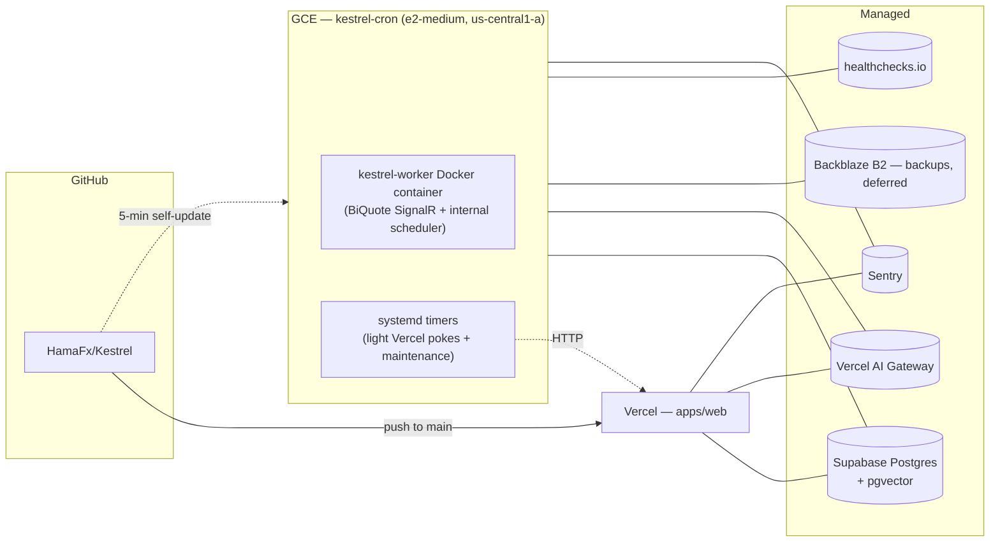

# 08 — Deployment

> **For local development:** see the [Quickstart section in README](../README.md#quick-start)
> — zero-config native (`pnpm dev:local`) or one-command Docker (`docker compose up`).
> This document covers the hosted deployment topology and operator procedures; the public OSS release itself is single-user self-hosted.

> **OSS boundary:** Shared PostgreSQL deployments, open registration, `MULTI_USER_ENABLED=1`, and `KESTREL_ENABLE_RLS=1` are not supported by this release. The hosted multi-user topology described below is maintained separately from the OSS self-hosting path.

## Topology

Hosted web + worker deployments, one push-to-main pipeline.



The web app is one Vercel deploy and the worker is one Docker container on one VM. Both pull from the same `main` branch. Vercel rebuilds on push; the VM's `kestrel-update.timer` pulls and rebuilds worker-relevant changes every 5 minutes.

## Vercel project

- **Project**: `hamafx-ai` (linked to the monorepo, `Root Directory = apps/web`).
- **Build command**: handled by Turborepo: `turbo run build --filter=web...`.
- **Install command**: `pnpm install --frozen-lockfile`.
- **Output**: standard Next.js.
- **Node**: 20.x.
- **Regions**: primary `iad1`; all API routes run Node.js runtime.
- **Deployment Protection**: not used (NextAuth protects the routes).
- **Environments**: `Production` (`main`), `Preview` (PRs), `Development` (local).

### `vercel.json`

```json
{
  "buildCommand": "pnpm dlx turbo run build --filter=web...",
  "framework": "nextjs",
  "installCommand": "pnpm install --frozen-lockfile",
  "ignoreCommand": "npx turbo-ignore web",
  "functions": {
    "src/app/api/chat/route.ts": { "maxDuration": 60 },
    "src/app/api/cron/news/route.ts": { "maxDuration": 60 },
    "src/app/api/cron/calendar/route.ts": { "maxDuration": 30 },
    "src/app/api/cron/alerts/route.ts": { "maxDuration": 15 },
    "src/app/api/cron/snapshots/route.ts": { "maxDuration": 30 }
  }
}
```

We do **not** ship a `crons` block in `vercel.json` — Vercel Hobby caps cron at once-per-day, and we run sub-5-minute cadences. Scheduling lives on the VM (see below).

### Edge vs Node runtime

- All API routes use **Node** runtime. Every `route.ts` under `apps/web/src/app/api/`
  declares `export const runtime = 'nodejs'` (71 route files verified). No route uses
  the Edge runtime. This is because all routes that touch the database use `getDb()`
  (postgres-js), which doesn't run on Edge. Even lightweight read routes
  (`/api/market/*`, `/api/news`, `/api/calendar`, `/api/alerts`, `/api/journal`)
  declare `nodejs` because they share the same DB client and auth middleware.
- If Edge runtime is desired for specific read-only routes in the future, they would
  need a separate Edge-compatible data layer (e.g. Supabase's Edge-compatible client).

## VM project

- **Instance**: `kestrel-cron` (`e2-medium`, `us-central1-a`, project `gen-lang-client-0103421645`, Ubuntu 24.04 LTS).
- **System user**: `kestrel` (system, `nologin`, owns `/opt/kestrel`).
- **Always-on**: Docker container `kestrel-worker`, with Docker health checks and restart-on-failure.
- **Timers**: Light HTTP pokes, cleanup, maintenance, backup placeholders, updates, and Docker housekeeping in `infra/cron-vm/units/`.
- **Worker jobs**: Heavy jobs run inside the Docker worker's internal scheduler. Separate heavy-job systemd timers were intentionally removed and must not be restored.
- **Self-update**: `kestrel-update.timer` pulls `origin/main`, rebuilds only when worker-relevant files change, and rolls back if the new container fails health checks.
- **Cost**: approximately $8–$17/mo depending on GCP billing discounts.

Bootstrap is `infra/cron-vm/_provision-docker.sh` (installs Docker, copies the worker and maintenance units, enables timers, masks the legacy `cron` daemon, installs sudoers, and configures journald). Recovery is `infra/cron-vm/RECOVERY.md` — read-only-first scenarios with paste-ready commands.

## Domains

Whatever apex you want — NextAuth handles authentication and protects all routes. Production currently lives at `hamafx-ai.vercel.app`.

## Environment variables

`.env.example` is the source of truth. Vercel envs mirror it for the web app; the VM has its own `/opt/kestrel/.env` that mirrors a subset (worker doesn't need PWA / NEXT_PUBLIC_*).

```
# --- App ---
NEXT_PUBLIC_APP_URL=https://hamafx-ai.vercel.app
PRODUCTION_URL=https://hamafx-ai.vercel.app                 # VM only — what the light crons curl

# --- Auth (NextAuth) ---
NEXTAUTH_URL=https://hamafx-ai.vercel.app
NEXTAUTH_SECRET=                 # run: openssl rand -base64 32
CRON_SECRET=                     # set on Vercel + on VM; used for /api/cron/* bearer
GOOGLE_CLIENT_ID=
GOOGLE_CLIENT_SECRET=
GITHUB_CLIENT_ID=
GITHUB_CLIENT_SECRET=
ENCRYPTION_SECRET=               # random 32-byte hex for data encryption

# --- Feature Flags ---
MULTI_USER_ENABLED=false
KESTREL_ENABLE_RLS=false
BYOK_ENABLED=true
UNLIMITED_SYMBOLS=false                 # deprecated; the canonical 18-symbol catalog is always enforced
PER_USER_BRIEFINGS=true

# --- Supabase (DB only — we don't use Supabase Auth) ---
DATABASE_URL=                    # Supabase pooler (transaction mode)
POSTGRES_URL=                    # alias accepted by the worker (Supabase Vercel integration ships this name)
SUPABASE_URL=                    # for direct REST if ever needed
SUPABASE_SERVICE_ROLE_KEY=

# --- AI (Vercel AI Gateway) ---
AI_GATEWAY_API_KEY=
AI_DEFAULT_MODEL=google-vertex/gemini-2.5-flash
AI_TITLE_MODEL=google-vertex/gemini-2.5-flash-lite
AI_EMBEDDING_MODEL=openai/text-embedding-3-small
# Domain-routed models were removed in Phase D2 — model selection is
# now handled internally by the AI agent's routing logic.
# AI_VISION_MODEL, AI_FUNDAMENTAL_MODEL, AI_TECHNICAL_MODEL, and
# AI_SUMMARY_MODEL are no longer read from the environment.

# --- Direct Google Vertex (optional — bypasses the gateway) ---
GOOGLE_VERTEX_PROJECT=
GOOGLE_VERTEX_LOCATION=
GOOGLE_APPLICATION_CREDENTIALS_JSON=

# --- Data providers ---
BIQUOTE_BASE_URL=https://biquote.io          # primary FX + XAU REST
BIQUOTE_HUB_URL=https://biquote.io/hubs/tick # SignalR endpoint
FINNHUB_API_KEY=                             # fallback FX + news
ALPHAVANTAGE_API_KEY=                        # backup historical
MARKETAUX_API_KEY=                           # primary news
TRADING_ECONOMICS_KEY=                       # macro calendar (optional)
FRED_API_KEY=                                # FRED actuals backfill

# --- Optional: Telegram alerts ---
TELEGRAM_BOT_TOKEN=
TELEGRAM_CHAT_ID=

# --- Web Push (server-side keys) ---
VAPID_PUBLIC_KEY=
VAPID_PRIVATE_KEY=
VAPID_SUBJECT=

# --- Observability ---
SENTRY_DSN=                                  # server-side Sentry DSN
LANGFUSE_PUBLIC_KEY=
LANGFUSE_SECRET_KEY=
LANGFUSE_BASE_URL=https://cloud.langfuse.com
LANGFUSE_RELEASE=                           # deployed commit/release label
LANGFUSE_TRACING_ENVIRONMENT=production
LANGFUSE_RECORD_IO=0                         # keep prompt/output capture disabled by default

# --- Operational retention ---
TELEMETRY_RETENTION_DAYS=90
TRACE_RETENTION_DAYS=30
RATE_LIMIT_RETENTION_HOURS=2
PROVIDER_DAILY_QUOTA_RETENTION_DAYS=3
CRON_RUN_RETENTION_DAYS=30
ANALYSIS_JOB_RETENTION_DAYS=7
BILLING_WEBHOOK_DLQ_RETENTION_DAYS=90
AI_EVALUATION_RETENTION_DAYS=90
PERSISTENCE_OUTBOX_RETENTION_DAYS=30
BUDGET_RESERVATION_RETENTION_DAYS=90

# --- VM-only ---
BACKUP_PROVIDER=b2                         # B2 setup is deferred
B2_BUCKET=                                   # private B2 bucket name
B2_KEY_ID=                                   # restricted B2 application key ID
B2_APPLICATION_KEY=                          # restricted B2 application key
# Backups remain skipped safely until the B2 values above are configured.
DEPLOYED_SHA=                                # written by update.sh after each pull
HC_SIGNALR_UUID=
HC_UPDATE_UUID=
HC_LIGHT_NEWS_UUID=
HC_LIGHT_CALENDAR_UUID=
HC_LIGHT_ALERTS_UUID=
HC_LIGHT_WARM_CACHE_UUID=
HC_JOB_BRIEFINGS_UUID=
HC_JOB_COT_UUID=
HC_JOB_EMBEDDING_BACKFILL_UUID=
HC_JOB_FRED_ACTUALS_UUID=
HC_JOB_SNAPSHOTS_UUID=
HC_JOB_WEEKLY_REVIEW_UUID=
HC_BACKUP_DB_UUID=
HC_BACKUP_JOURNAL_UUID=
HC_VERIFY_RESTORE_UUID=
```

`packages/shared/src/env.ts` exports `envSchema` (zod) used at boot. `apps/worker/src/env.ts` validates the worker subset. Boot fails fast on missing/invalid envs.

### Generating secrets

```bash
# NEXTAUTH_SECRET and ENCRYPTION_SECRET
node -e "console.log(require('crypto').randomBytes(32).toString('hex'))"

# CRON_SECRET — must match between Vercel and /opt/kestrel/.env
node -e "console.log(require('crypto').randomBytes(24).toString('hex'))"
```

### Seeding the VM

`/opt/kestrel/.env` should be hand-written from a secure paste, mode `600`, owned by `kestrel`. Vercel CLI's `vercel env pull` redacts encrypted values, so you can't migrate them automatically — paste from the Vercel dashboard instead. `infra/cron-vm/RECOVERY.md` § Pre-flight has the full list.

## CI

`.github/workflows/ci.yml` runs `pnpm turbo run lint typecheck test` on every PR + push to main. **No deploy step**; Vercel handles the web deploy and the VM's `kestrel-update.timer` handles the worker update. The legacy `.github/workflows/cron-*.yml` files were retired in Phase 8 PR-21. Host maintenance and lightweight Vercel pokes use systemd timers; heavy worker jobs use the Docker worker's internal scheduler.

## Supabase setup (one-time)

1. Create a Supabase project (Free tier).
2. Enable `pgvector`:
   ```sql
   create extension if not exists vector;
   ```
3. Copy the **pooler** connection string (Transaction mode) from Project Settings → Database → "Connection pooling". That goes into `DATABASE_URL` (and `POSTGRES_URL`).
4. We do **not** enable Supabase Auth — we use NextAuth directly with our own Postgres tables.
5. We handle data isolation in the application layer (row-level checks on `userId`) rather than Postgres RLS.

> Supabase Free tier pauses a project after 7 days of _no activity_. With the worker hitting the DB every second and the timers firing every few minutes, this never triggers. If you ever take a long break, manually unpause from the dashboard.

## Backups (B2 setup deferred)

The code is prepared for a private Backblaze B2 bucket with seven-day retention.
Create the B2 account and restricted application key later, then install
`rclone` on the VM and set `BACKUP_PROVIDER=b2`, `B2_BUCKET`, `B2_KEY_ID`, and
`B2_APPLICATION_KEY` in `/opt/kestrel/.env`. Configure B2 lifecycle cleanup for
seven days and old file versions. Until then, backup and restore timers are
installed but skipped safely; they do not report false success.

## Database migrations

- Before production migration work, follow the migration rules in [`AGENTS.md`](../AGENTS.md) and the database deployment procedure in this guide.
- `pnpm --filter @kestrel/db migrate:reconcile` is a strictly read-only report of migration hashes, duplicate briefing threads, required columns/indexes, and role/RLS state.
- Schema lives in `packages/db/src/schema/*.ts`.
- `pnpm --filter @kestrel/db migrate:gen` creates SQL.
- `pnpm --filter @kestrel/db migrate:apply` runs against `DATABASE_URL`.
- **Migrations are now automatic on Vercel.** The `vercel.json`
  `buildCommand` runs `node scripts/predeploy-migrate.mjs` BEFORE
  `next build`. The script applies pending migrations against the
  production database via `POSTGRES_URL_NON_POOLING` and exits
  non-zero on failure — so a bad migration blocks the deploy
  instead of failing page renders. Preview deploys (`VERCEL_ENV=preview`)
  skip migrations; configure a per-preview DB if you want them
  to migrate against a non-prod target.
- **Manual one-liner** (still works for non-Vercel deploys):
  `POSTGRES_URL_NON_POOLING=… node scripts/predeploy-migrate.mjs`

## Logging & monitoring

- **Web logs**: Vercel function logs.
- **Worker logs**: `sudo docker logs kestrel-worker` plus `journalctl -u kestrel-update.service` and light/maintenance units. JSON-structured worker logs carry the deployed commit.
- **Healthchecks.io**: every heartbeat / job emits a `start` + `success`/`fail` ping. A stale check pages immediately.
- **Sentry**: server-side errors from both `apps/web` and `apps/worker` flow into the same project. The worker's heavy-job runner adds `{ job: <name> }` to every event.
- **Cost telemetry**: `chat_telemetry` table → `/settings/usage` UI.
- **Admin SLO dashboard**: `/admin` → System Health shows tick freshness, cron/tool health, Full-mode completion, sentiment failures, provider fallback usage, persistence dead letters, budget recovery errors, and trace-sink failures.
- **Alert thresholds**: page on stale ticks, stuck analysis jobs, dead outbox rows, budget recovery errors, trace failures, Full-mode completion below 99.5%, sentiment success below 95%, or fallback-free traces below 95%.
- **Privacy default**: Langfuse prompt/output capture is disabled (`LANGFUSE_RECORD_IO=0`), and user/thread IDs exported to Langfuse are pseudonymized. Raw correlation remains in the tenant-scoped database trace explorer.

If something feels slow or expensive, look at Vercel function logs + `chat_telemetry` first, then `journalctl` on the VM, then healthchecks.io for "what stopped firing".

## Local production-like verification

Before diagnosing a local build or E2E failure, run the read-only guard:

```bash
pnpm verify:local
```

It fails when `.env.local` leaves `AUTH_MODE=legacy` or disables database TLS
verification, because either setting can produce misleading auth/prerender
failures. Temporary overrides require explicit `ALLOW_LEGACY_LOCAL=1` or
`ALLOW_INSECURE_LOCAL_TLS=1` and should never be copied to Vercel.

## Production verification (Phase 10)

Run the read-only verification after Vercel deploy and after the worker update:

```bash
PRODUCTION_URL=https://hamafx-ai.vercel.app \
WORKER_HEALTH_URL=http://<worker-ip>:8081 \
WORKER_HEALTH_TOKEN=<worker-health-token> \
pnpm verify:production
```

For a direct migration status check, run it from a trusted operator shell with
`DIRECT_URL` or `POSTGRES_URL_NON_POOLING` (never the Supabase transaction
pooler):

```bash
PRODUCTION_URL=https://hamafx-ai.vercel.app \
DIRECT_URL='postgresql://<redacted>' \
VERIFY_MIGRATIONS=1 \
pnpm verify:production
```

The command checks `/api/health/public`, optionally checks the worker health
endpoint and the bearer-authenticated `/api/health/alerts` contract, validates
that production has a direct migration connection, and fails on partial
Langfuse configuration. External monitors should poll the alert contract with
`Authorization: Bearer $CRON_SECRET`; it returns `503` with the failed SLI keys
and anomalies so alert payloads remain actionable. Example:

```bash
curl --fail-with-body -H "Authorization: Bearer $CRON_SECRET" \\
  https://hamafx-ai.vercel.app/api/health/alerts
```

Use `VERIFY_ALERTS=1 PRODUCTION_CRON_SECRET=...` with `verify:production` to
validate this contract after a deploy. It never applies migrations or prints
secret values. Vercel production builds run
`scripts/predeploy-migrate.mjs` automatically; that script performs the
hash-safety check and applies pending migrations before `next build`.

Deployment acceptance checklist:

- [ ] Vercel deployment is healthy and `/api/health/public` returns `200`.
- [ ] `DIRECT_URL` or `POSTGRES_URL_NON_POOLING` exists in Vercel Production.
- [ ] Vercel logs show the predeploy migration safety check and no pending migrations.
- [ ] Worker Docker health is `healthy` and `DEPLOYED_SHA` matches the deployed commit.
- [ ] `WORKER_HEALTH_TOKEN` is configured on the VM and Vercel; port 8081 is never exposed without bearer protection.
- [ ] Langfuse has all three credentials configured, or all three are intentionally absent.
- [ ] `LANGFUSE_RECORD_IO=0` unless prompt/output capture has explicit approval.
- [ ] `/admin` → System Health shows no stale ticks, dead outbox rows, budget errors, or trace sink failures.
- [ ] Retention logs report cleanup for telemetry, traces, jobs, outbox, and budget ledger rows.

## Rollback

- **Web**: instant via Vercel "Rollback to deployment" in the dashboard.
- **VM**: `kestrel-update.timer` pulls every 5 min. To pin to an older commit:
  ```bash
  sudo systemctl mask kestrel-update.timer  # stop the auto-update
  sudo -u kestrel git -C /opt/kestrel/app fetch origin
  sudo -u kestrel git -C /opt/kestrel/app reset --hard <good-sha>
  sudo -u kestrel pnpm -C /opt/kestrel/app install --frozen-lockfile
  sudo -u kestrel pnpm -C /opt/kestrel/app --filter @kestrel/worker build
  echo <good-sha> | sudo tee /opt/kestrel/.deployed-sha
  sudo docker compose -f /opt/kestrel/docker-compose.yml up -d --force-recreate worker
  ```
  Then push the fix to `main` and unmask the timer.
- **DB**: forward-only migrations. For emergencies, restore from the latest B2 backup after it is configured, per `infra/cron-vm/RECOVERY.md` § Scenario 1.

## Cost ceiling (your own usage)

| Component                              | Estimate / month                           |
| -------------------------------------- | ------------------------------------------ |
| Vercel Hobby                           | $0                                         |
| GCE `e2-medium` VM                     | ~$8                                        |
| Backblaze B2 backup storage (deferred) | $0–$1                                      |
| Supabase Free                          | $0                                         |
| Data providers                         | $0 (BiQuote + Finnhub free tiers cover it) |
| AI Gateway / models                    | $3–$15 (your usage)                        |
| Sentry / healthchecks.io               | $0 (free tiers)                            |
| **Total**                              | **$11–$25 / month**                        |

Designed so a hobby personal run sits comfortably under $25/mo.
